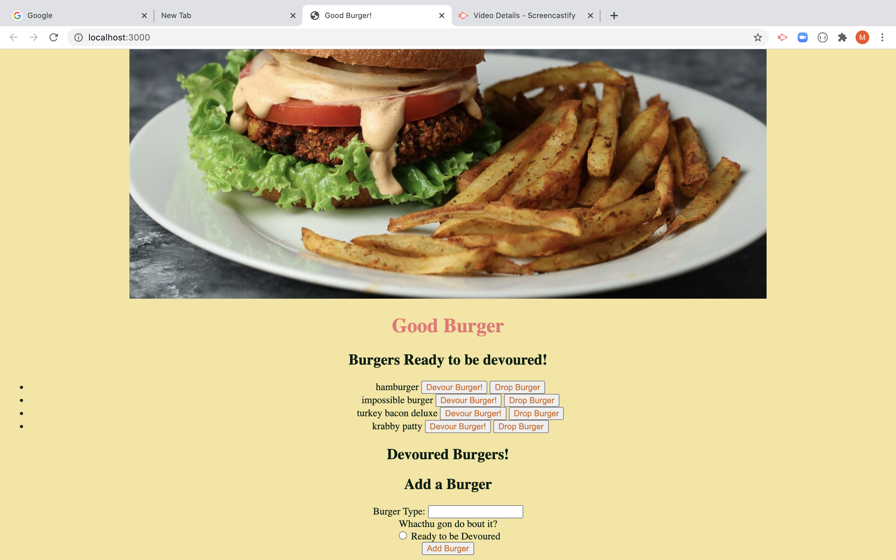

# Good Burger

# Table of Contents:
- [Description](#Description)
- [Installation Instruction](#Instructions)
- [Project Original Contributor](#Deployer)
- [Project Contributors](#Contributors)
- [Github Repo](#Repo)
- [Heroku App](#Heroku)
- [Link](#Demo)
- [Screenshot](#Screenshot)
- [Project Question](#Questions)

# Description:
  This project was developed as a part of a homework assignment where we were asked to create an application where user can add, delete and update the burger database.

# Installation Instructions:
  The installation process for this project is quite similar to other projects we created. 
  First we will need to initialize the package.json file as such
  ```
  npm init -y
  ```
  Then we install the required dependencies as follows.
  ```
  npm install mysql
  npm install express
  npm install express-handlebars
  npm install dotenv
  ```

# Project Original Contributor:
  The project's source code was provided to us by the Teachers and TAs. The logic, routing files and database files were created by me.

# Project Contributors:
  Anyone with a github account can contribute to this project. 

# Github Repo:
- [Repo](https://github.com/maurya512/Good_Burger)

# Heroku App:
- [App](https://mygoodburger.herokuapp.com/)

# Demo:
- [Link](https://drive.google.com/file/d/1rluWsmFI0Bz9RhUGf7hzIxq6wNbu-aCS/view)

# Screenshot:
  Screenshot of the homepage.
  

# Questions:
   Any questions regarding this project can be directed at:
- [Github User](https://github.com/maurya512)
- [Email](patelmaurya0512@gmail.com)